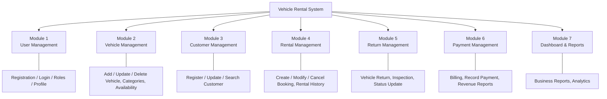

# Vehicle Rental System — Module Diagram

**Project Brief 10 — Vehicle Rental System**

## Exercise 1: Identify System Modules

## Module Summary

| Module | Responsibilities |
|---|---|
| User Management | User Registration, User Login, Role Management, Password Management, Profile Management |
| Vehicle Management | Add/Update/Delete Vehicle, Vehicle Categories, Vehicle Availability |
| Customer Management | Register Customer, Update Customer Information, Search Customers, Customer Profiles |
| Rental Management | Create/Modify/Cancel Rental Booking, Rental History, Rental Status |
| Return Management | Vehicle Return, Return Inspection, Update Vehicle Status, Rental Completion |
| Payment Management | Rental Billing, Record Payments, Payment History, Revenue Reports |
| Dashboard & Reports | Business reports and analytics across all modules |