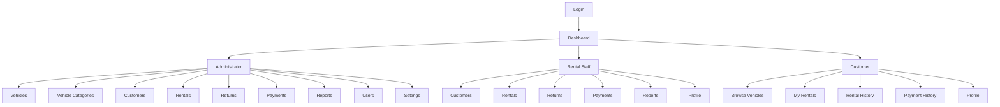

# Vehicle Rental System — Navigation Flow

**Project Brief 10 — Vehicle Rental System**

## Exercise 4: Design Application Navigation

## Navigation Summary by Role

| Role | Pages |
|---|---|
| Administrator | Dashboard, Vehicles, Vehicle Categories, Customers, Rentals, Returns, Payments, Reports, Users, Settings |
| Rental Staff | Dashboard, Customers, Rentals, Returns, Payments, Reports, Profile |
| Customer | Dashboard, Browse Vehicles, My Rentals, Rental History, Payment History, Profile |

## Public Pages (Pre-Login)

- Home
- Available Vehicles
- Vehicle Details
- Login
- Register
- About
- Contact